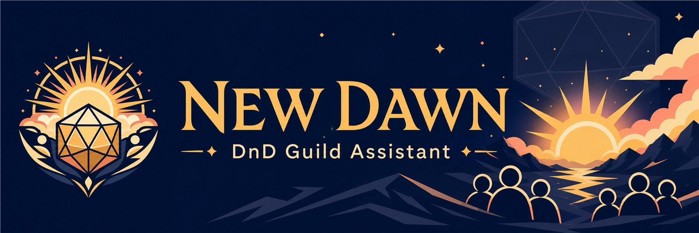

# DnD New Dawn Guild Assistant

A Discord bot that organizes a weekly tabletop night. Players use buttons in
Discord to volunteer as a GM, sign up to play, choose a table, or withdraw. The
bot handles the schedule, fair GM selection, table sizes, waitlists, reminders,
and the final roster.

## Start with your role

You only need the guide for the job you are doing.

| I am… | What I need |
| --- | --- |
| A player or GM | [Player and GM guide](docs/player-guide.md) — Discord buttons and the few player commands. Nothing to install. |
| A weekly organizer | [Organizer guide](docs/organizer-guide.md) — run the week entirely inside Discord. No command line. |
| The Discord server owner | [Discord server setup](docs/guild-setup.md) — use this after the bot responds to `/ping`. |
| The person putting the bot online | [First deployment](docs/first-deployment.md) — the technical Discord and Cloudflare setup. |
| A service maintainer | [Operations guide](docs/operations.md) — updates, backups, recovery, and handoff. |
| A developer | [Contributing guide](CONTRIBUTING.md) — local tools, tests, and code changes. |

The complete audience-based documentation map is in [docs/README.md](docs/README.md).

## What players see

A normal week happens in Discord:

1. GMs click **Run a Game** when GM signup opens.
2. Players click **Play** when player signup opens.
3. The bot publishes the tables and says who has a reserved place or is waiting.
4. Players click **Join** on a table. Later, any unclaimed seats become
   first-come, first-served.
5. At game time, the bot closes table choices and posts the final roster.

Use `/help` in Discord for a private explanation at any time. Players do not run
setup, deployment, database, or npm commands.

## What the bot handles

- A five-stage weekly schedule in the guild's own time zone.
- Fair, repeatable GM rotation and table planning.
- Signup-order reservations, a global waitlist, table waitlists, and automatic
  promotion when a seat opens.
- Review mode for organizers who want to approve tables, or Autopilot after the
  guild is comfortable with the workflow.
- Optional reminders and a temporary Weekly GM role.
- Final rosters, attendance confirmation, and DM priority tokens.
- Safe retries and an audit trail so a timeout does not create duplicate weeks,
  tables, reminders, or rewards.

Discord remains the member-facing home. Cloudflare Workers runs the bot, D1
stores its state, and a scheduled trigger advances the week. No volunteer's
computer has to remain switched on.

## Permissions and privacy

The bot should not receive Discord Administrator permission. Its core channel
permissions are View Channels, Send Messages, Embed Links, and Read Message
History. Manage Roles and Attach Files are optional and should be granted only
when those features are used.

Admin responses and priority-token details are private. The bot restricts
mentions, does not require Google or Raid Helper credentials, and provides a
private CSV export only when an administrator asks for one.

See [SECURITY.md](SECURITY.md) for private vulnerability reporting and the
[operations guide](docs/operations.md#data-retention-and-deletion) for data
handling and deletion.

## Project status

The weekly workflow is implemented end to end and covered by unit and D1
integration tests. Raid Helper may remain beside the bot for unrelated events,
but it is not a dependency. The boundaries are recorded in the
[Raid Helper decision](docs/decisions/0001-raid-helper-boundary.md) and
[export decision](docs/decisions/0002-export-boundary.md).

Contributions are welcome under the [MIT License](LICENSE). Start with
[CONTRIBUTING.md](CONTRIBUTING.md).
